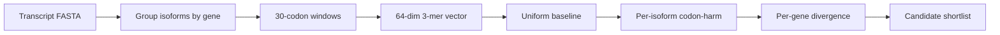

# NoHarm

Annotation-free prioritization of structurally divergent transcript isoforms.

NoHarm is a lightweight bioinformatics scanner for ranking genes whose transcript
isoforms diverge strongly in a fixed 3-mer frame-economy coordinate. It is
designed as a low-cost triage layer: run it on a transcript FASTA, get a short
list of genes and isoform pairs that may deserve biological follow-up.

The tool does **not** make clinical claims, diagnose disease, or infer causal
mechanisms. It produces a reproducible structural ranking.

## At A Glance



In one sentence:

> NoHarm asks how different the codon landscapes are that translation must
> process across isoforms of the same gene.

## Why This Exists

Long-read transcriptomics and modern genome annotation produce very large
isoform sets. The hard question is often not "are there isoforms?", but:

> Which isoforms are most likely to change the translation-facing structure of a gene?

NoHarm provides one annotation-free coordinate for that triage problem.

## Quick Start

From the repository root:

```bash
python -m pip install -e .
noharm scan --fasta data/demo_isoforms.fa --out results/demo
```

Or without installation:

```bash
$env:PYTHONPATH="src"
python -m noharm scan --fasta data/demo_isoforms.fa --out results/demo
```

For a GENCODE transcript FASTA:

```bash
noharm scan --fasta gencode.v49.pc_transcripts.fa.gz --out results/gencode_v49 --workers 8
```

## Outputs

`noharm scan` writes:

- `gene_divergence.tsv` — gene-level isoform divergence ranking.
- `isoform_scores.tsv` — per-transcript scores.
- `summary.json` — parameters, distribution, and top genes.
- `report.md` — small human-readable report.

Key columns:

- `ch_range`: max isoform mean cross-harm minus min isoform mean cross-harm.
- `ch_std`: within-gene dispersion of isoform scores.
- `tau_range`: spread in the lightweight frame-economy trace.
- `min_ch_transcript`, `max_ch_transcript`: the top contrast pair.

## Research Preview Results

The June 2026 GENCODE v49 scan processed 245,535 protein-coding transcripts,
covering 17,903 multi-isoform genes. The resulting distribution had a small
extreme tail: P99 `Delta |codon-harm| = 0.0586`, with only 29 genes above `0.1`.

Top matched-null genes include known biologically structured loci such as
`SLC39A11`, `MED12`, `SRP14`, `FLOT1`, `HNRNPA1`, and `HLA-F`, plus
under-characterized candidates such as `ANKRD18B`, `SH3BGR`, `SEPTIN11`, and
`PAXBP1`.

See:

- [Experiment Report](docs/EXPERIMENT_REPORT.md)
- [Top 20 Annotation](docs/TOP20_ANNOTATION.md)
- [Top 20 TSV](data/gencode_v49_top20.tsv)
- [Workflow](docs/WORKFLOW.md)
- [Method Notes](docs/METHOD.md)

## Default Method

The public scanner intentionally fixes the encoder:

1. Split each transcript into non-overlapping 3-mer positions.
2. Slide a 30-codon window across the transcript.
3. Convert each window into a normalized 64-dimensional 3-mer vector.
4. Subtract the uniform 64-bin baseline.
5. Average the vector magnitude over windows to score each isoform.
6. Rank each gene by the range of isoform scores.

No GO terms, disease labels, expression values, protein domains, or genetic-code
semantics are used by the default ranking.

## Current Interpretation

NoHarm should be read as:

> An annotation-free prioritization layer for transcript isoform structural divergence.

The score is a candidate generator. Known high-ranking genes can calibrate the
signal; under-characterized high-ranking genes become follow-up candidates.

## Important Caveats

- The standalone public scanner reproduces the primary `Delta |codon-harm|`
  ranking coordinate. The full research Geruon tau/L3 dynamics remain in the EE
  research code; this repo uses a lightweight tau trace for reporting.
- Matched null controls currently cover isoform count, transcript length range,
  and mean codon-harm. GC matching is not yet included.
- CDS/full comparisons currently use a longest-ORF proxy, not GTF-annotated CDS
  coordinates.
- Biological annotations are for hypothesis generation and require independent
  validation.

## Status

Research preview, June 2026.

Planned next steps:

- Matched null controls by isoform count, transcript length, GC range, and mean score.
- CDS-only and UTR-aware modes.
- Gene-level codex construction from isoform traces.
- Optional protein/topology annotation joins.

## License

MIT License. See [LICENSE](LICENSE).
