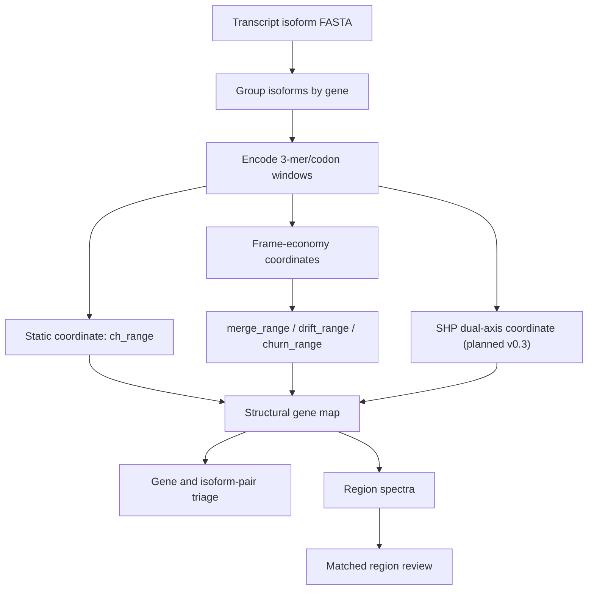

# NoHarm

Annotation-free structural screening for transcript isoforms and genomic
regions.

NoHarm is a lightweight bioinformatics scanner for transcript FASTA files. It
groups transcript isoforms by gene, encodes each isoform as sliding 3-mer/codon
windows, and reports a structural coordinate map:

- `ch_range`: a static codon-landscape residue against a shared uniform 64-bin
  baseline.
- `merge_range`: a frame-economy response, measured as the within-gene range of
  centroid-memory merge rates across isoforms.
- `drift_range`, `churn_range`, `tau_range`: additional detector-response
  traces for follow-up analysis and region-level spectra.

The practical use case is first-pass triage:

> I have many transcript isoforms, candidate genes, or loci. Which ones deserve
> closer inspection before expensive biological follow-up?

NoHarm does not make clinical claims, diagnose disease, or infer causal
mechanisms. It produces reproducible structural coordinates and contrast pairs
for follow-up.

## Status

Research preview, June 2026.

Current release posture: v0.2 is a corrected baseline, not the next major
outreach release. A calibrated dual-axis SHP coordinate has now been validated
in the companion GeneGrammar work; the next intended public feature release is
v0.3, after that coordinate is exposed as an optional `--dual` scan mode in
NoHarm.

Legacy preprint DOI: [10.5281/zenodo.20518088](https://doi.org/10.5281/zenodo.20518088)

Contact: [jackey.l.gene@outlook.com](mailto:jackey.l.gene@outlook.com)

Open discussion is welcome. If you have transcript isoform FASTA files, region
sets, matched-null suggestions, or a biological case where this kind of
annotation-free structural triage might be useful, please open an issue or
contact me by email. The current repo is deliberately small so that other
researchers can inspect, criticize, and adapt the method.

## At A Glance



In one sentence:

> NoHarm asks whether isoforms from the same gene diverge in static codon
> landscape, in detector-level processing response, or in both.

## Why This Exists

Long-read transcriptomics and modern genome annotation produce very large
isoform sets. The bottleneck is often prioritization: a lab may already have
hundreds or thousands of transcript candidates, but only a small subset can be
validated with proteomics, Ribo-seq, reporter assays, localization experiments,
or perturbation studies.

NoHarm gives a low-prior view that does not require expression values, GO terms,
disease labels, protein domains, or conservation scores.

## Quick Start

From the repository root:

```bash
python -m pip install -e .
noharm scan --fasta data/demo_isoforms.fa --out results/demo
```

Or without installation:

```powershell
$env:PYTHONPATH="src"
python -m noharm scan --fasta data/demo_isoforms.fa --out results/demo
```

For a GENCODE transcript FASTA:

```bash
noharm scan --fasta gencode.v49.pc_transcripts.fa.gz --out results/gencode_v49 --workers 8
```

To rank by the primary frame-economy response coordinate:

```bash
noharm scan --fasta gencode.v49.pc_transcripts.fa.gz --out results/gencode_v49_merge --workers 8 --rank-by merge_range
```

For a small real-data demo bundled with the repo:

```bash
noharm scan --fasta data/gencode_v49_mini_80genes.fa --out results/mini_80 --workers 4
```

The bundled mini FASTA contains 80 real GENCODE v49 genes and 566 transcripts.
It runs in about 4 seconds on the current development machine and is a demo
subset, not the full benchmark used in the report.

## Outputs

`noharm scan` writes:

- `gene_divergence.tsv`: gene-level isoform divergence ranking.
- `isoform_scores.tsv`: per-transcript scores.
- `summary.json`: parameters, distributions, and top genes.
- `report.md`: small human-readable report.

Example `gene_divergence.tsv` columns:

```text
gene    n_isoforms    ch_range    merge_range    drift_range    churn_range    contrast_metric    min_contrast_transcript    max_contrast_transcript
```

Key fields:

- `ch_range`: max isoform mean codon-harm minus min isoform mean codon-harm.
- `merge_range`: max isoform merge rate minus min isoform merge rate.
- `drift_range`: range of centroid-norm drift across isoforms.
- `churn_range`: range of frame-count churn across isoforms.
- `contrast_metric`: the metric used to choose the reported contrast pair.
- `min_contrast_transcript`, `max_contrast_transcript`: the isoform pair for
  the active ranking coordinate.
- `min_ch_transcript`, `max_ch_transcript`: the static `ch_range` contrast pair.

## Current GENCODE Result (v0.2 warm-start)

**Important**: v0.2 adds a pre-warm step (32 uniform-zero vectors) before processing
each isoform. This eliminates a cold-start artifact that suppressed `merge_range`
values in v0.1 and inflated the apparent sparsity of the frame-economy coordinate.
`ch_range` (static L2) is unaffected by this change.

The June 2026 GENCODE v49 scan (warm-start) processed 245,535 protein-coding
transcript records covering 17,903 multi-isoform genes.

Static coordinate:

- `ch_range` P99 = 0.0586 (unchanged).
- 29 genes exceed `ch_range > 0.1`.

Frame-economy coordinate (warm-start corrected):

- `merge_range` P50 = 0.297.
- `merge_range` P99 = 0.694.
- No genes at zero; the cold-start floor has been removed.

Coordinate relationship (warm-start corrected):

- Spearman between `ch_range` and `merge_range` is about 0.62 (was 0.21 in v0.1; the cold-start inflated apparent independence).
- The two coordinates remain distinct but are now moderately correlated.

Top genes by `merge_range` (warm-start): RYR3, GRIN2A, TNXB, ATRX, CREBBP, NRXN1 -
large, structurally complex genes with known disease associations.

This is a substantial correction. See [docs/EXPERIMENT_REPORT.md] for details.

See:

- [Experiment Report](docs/EXPERIMENT_REPORT.md)
- [Method Notes](docs/METHOD.md)
- [Workflow](docs/WORKFLOW.md)
- [Roadmap](docs/ROADMAP.md)
- [GeneGrammar / SHP Bridge](docs/GENEGRAMMAR_BRIDGE.md)
- [Static Top 20 Annotation](docs/TOP20_ANNOTATION.md)

## GeneGrammar / SHP Bridge

The current NoHarm CLI reports static and frame-economy response coordinates.
The next coordinate comes from GeneGrammar: a calibrated SHP readout that
compares two views of the same nucleotide stream:

- chroma: which 3-mers are present in a local window;
- rhythm: which 3-mer transitions occur in that window;
- cross-harm: Jaccard distance between the two binary activation sets;
- fixed_wit: event rate above a fair-IID threshold (`theta_0 = 0.0999` for
  k=4, n=3, D=64, W=128).

In a full human protein-coding genome scan, this SHP coordinate produced a
CDS/UTR structural matrix across 19,491 genes and 224,518 transcript isoforms.
It is not a replacement for the current NoHarm isoform-divergence scanner; it
is the planned v0.3 `--dual` extension for region and gene-regime screening.

## Case-Study Directions

Current work uses the coordinate map in two exploratory directions:

- **Gene and region recognition.** Known structural, secreted, immune, and
  regulatory loci appear to occupy different regions of the NoHarm coordinate
  map. This is being developed as region-level structural spectroscopy.
- **AD-associated gene audit.** Early Alzheimer's disease analyses suggest that
  global disease-label enrichment is strongly affected by annotation and study
  visibility, while tau-related and amyloid-processing genes may show different
  detector-response directions. This remains exploratory and non-clinical.
- **Protein folding extension.** A protein-structure axis is under active
  research. Early SHP-Fold tests suggest that changing the rhythm axis from
  linear sequence adjacency to 3D contact structure can reveal signals invisible
  to a 1D scan. This is not part of the public NoHarm CLI yet.

## Interpretation

NoHarm should be read as:

> an annotation-free structural triage layer for transcript isoform sets, with
> a static codon-landscape readout and frame-economy detector-response readouts.

`merge_range`, `drift_range`, and related traces are properties of the NoHarm
detector's response to codon-window streams. They are not direct evidence that
cellular translation machinery uses the same mechanism.

## Important Caveats

- The current defaults are fixed for reproducible screening, not optimized
  biology.
- `merge_range` and other response coordinates depend on detector parameters
  (`memory_cap`, `merge_radius`, window size, and stride).
- Biological annotations are post-hoc and hypothesis-generating.
- Disease case studies are exploratory and non-clinical.
- Region analyses require matched nulls and independent review before strong
  claims.

## Planned Next Work

- Integrate the GeneGrammar SHP dual-axis readout as an optional `--dual` mode.
- Package a small reproducible dual-axis demo for PRB/KRTAP, HOX, MHC/HLA, and
  matched background regions.
- Package v0.3 as a single release containing the warm-start bugfix,
  current static/response coordinates, and the new dual-axis coordinate.
- GC, length, isoform-count, and visibility-matched nulls for response metrics.
- Comparison with CAI, ENC, GC, codon-usage, and existing isoform metrics.
- GTF-based CDS and UTR extraction.
- Region-level spectra for known loci such as PRB/KRTAP, MHC, HOX, and selected
  regulatory regions.
- Protein-fold / 3D contact-map extension as a separate research track.
- Parameter sweeps for `merge_radius`, memory capacity, window size, and stride.
- A frozen case-study package before any manuscript submission.

## Related Work

NoHarm is a practical tool extracted from a broader frame-economy research
program. The repo is meant to be usable without accepting any broader theory.
Readers interested in the conceptual background can browse the GBE project:
[https://jackeylgene.github.io/GBE](https://jackeylgene.github.io/GBE).

## License

MIT License. See [LICENSE](LICENSE).
