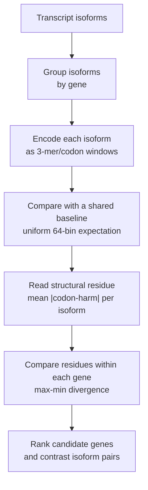

# NoHarm

Annotation-free prioritization of structurally divergent transcript isoforms.

NoHarm is a lightweight bioinformatics scanner for ranking genes whose transcript
isoforms diverge strongly in a fixed 3-mer codon-landscape coordinate. It is
designed as a low-cost triage layer: run it on a transcript FASTA, get a short
list of genes and isoform pairs that may deserve biological follow-up.

The tool does **not** make clinical claims, diagnose disease, or infer causal
mechanisms. It produces a reproducible structural ranking.

For researchers with transcript isoform FASTA files who need a first-pass
prioritization of genes and isoform pairs.

## Preprint and Contact

Preprint DOI: [10.5281/zenodo.20518088](https://doi.org/10.5281/zenodo.20518088)

Contact: [jackey.l.gene@outlook.com](mailto:jackey.l.gene@outlook.com)

## At A Glance



In one sentence:

> NoHarm asks how much the codon landscapes of isoforms from the same gene
> differ after being projected onto a shared baseline.

## Why This Exists

Long-read transcriptomics and modern genome annotation produce very large
isoform sets. The hard question is often not "are there isoforms?", but:

> Which genes have isoforms whose codon landscapes diverge enough to deserve a
> closer look?

NoHarm provides one annotation-free coordinate for that triage problem.

## Quick Start

From the repository root:

```bash
python -m pip install -e .
noharm scan --fasta data/demo_isoforms.fa --out results/demo
```

Or without installation:

```bash
$env:PYTHONPATH="src"
python -m noharm scan --fasta data/demo_isoforms.fa --out results/demo
```

For a GENCODE transcript FASTA:

```bash
noharm scan --fasta gencode.v49.pc_transcripts.fa.gz --out results/gencode_v49 --workers 8
```

For a small real-data demo bundled with the repo:

```bash
noharm scan --fasta data/gencode_v49_mini_80genes.fa --out results/mini_80 --workers 4
```

The bundled mini FASTA contains 80 real GENCODE v49 genes and 566 transcripts.
It runs in about 4 seconds on the current development machine and is a
smoke/demo subset, not the full benchmark used in the report.

## Outputs

`noharm scan` writes:

- `gene_divergence.tsv` — gene-level isoform divergence ranking.
- `isoform_scores.tsv` — per-transcript scores.
- `summary.json` — parameters, distribution, and top genes.
- `report.md` — small human-readable report.

Key columns:

- `ch_range`: max isoform mean cross-harm minus min isoform mean cross-harm.
- `ch_std`: within-gene dispersion of isoform scores.
- `tau_range`: spread in the lightweight residue trace.
- `min_ch_transcript`, `max_ch_transcript`: the top contrast pair.

Example output from the bundled mini dataset:

```tsv
gene        n_isoforms  ch_range  mean_ch  min_ch_transcript  max_ch_transcript
SLC12A5     12          0.141969  0.235011 ENST00000616933.4  ENST00000413737.2
SUPT5H      12          0.125129  0.240485 ENST00000593727.1  ENST00000594729.5
ANKRD18B    7           0.123465  0.222918 ENST00000703167.1  ENST00000605687.1
CARM1       9           0.117099  0.227537 ENST00000590039.5  ENST00000588947.5
ZNF384      12          0.115998  0.226833 ENST00000535485.5  ENST00000545946.1
SRP14       6           0.114499  0.244790 ENST00000559081.1  ENST00000560773.5
PRG4        12          0.113135  0.248118 ENST00000862631.1  ENST00000367482.8
SEPTIN11    10          0.094676  0.213577 ENST00000512778.1  ENST00000502401.1
SH3BGR      12          0.094176  0.232811 ENST00000440288.6  ENST00000423596.5
PAXBP1      10          0.085664  0.220020 ENST00000445049.1  ENST00000573680.5
```

## Research Preview Results

The June 2026 GENCODE v49 scan processed 245,535 protein-coding transcripts,
covering 17,903 multi-isoform genes. The resulting distribution had a small
extreme tail: P99 `Delta |codon-harm| = 0.0586`, with only 29 genes above `0.1`.

Top matched-null genes include known biologically structured loci such as
`SLC39A11`, `MED12`, `SRP14`, `FLOT1`, `HNRNPA1`, and `HLA-F`, plus
under-characterized candidates such as `ANKRD18B`, `SH3BGR`, `SEPTIN11`, and
`PAXBP1`.

See:

- [Experiment Report](docs/EXPERIMENT_REPORT.md)
- [Top 20 Annotation](docs/TOP20_ANNOTATION.md)
- [Top 20 TSV](data/gencode_v49_top20.tsv)
- [Workflow](docs/WORKFLOW.md)
- [Method Notes](docs/METHOD.md)

## Default Method

The public scanner intentionally fixes the encoder:

1. Split each transcript into non-overlapping 3-mer positions.
2. Slide a 30-codon window across the transcript.
3. Convert each window into a normalized 64-dimensional 3-mer vector.
4. Subtract the uniform 64-bin baseline.
5. Average the vector magnitude over windows to score each isoform.
6. Rank each gene by the range of isoform scores.

No GO terms, disease labels, expression values, protein domains, or genetic-code
semantics are used by the default ranking.

## Current Interpretation

NoHarm should be read as:

> An annotation-free prioritization layer for transcript isoform codon-landscape divergence.

The score is a candidate generator. Known high-ranking genes can calibrate the
signal; under-characterized high-ranking genes become follow-up candidates.
Because codon usage can influence downstream biology, high-ranking genes may be
useful candidates for follow-up, but the v0.1 scanner does not directly model
gene-to-protein translation.

## Important Caveats

- The standalone public scanner reproduces the primary `Delta |codon-harm|`
  ranking coordinate. It compares isoforms to a shared uniform baseline; it does
  not yet implement the deeper gene/transcript-to-CDS/protein alignment planned
  for later NoHarm work.
- Matched null controls currently cover isoform count, transcript length range,
  and mean codon-harm. GC matching is not yet included.
- CDS/full comparisons currently use a longest-ORF proxy, not GTF-annotated CDS
  coordinates.
- Biological annotations are for hypothesis generation and require independent
  validation.

## Status

Research preview, June 2026.

Planned next steps:

- Matched null controls by isoform count, transcript length, GC range, and mean score.
- CDS-only and UTR-aware modes.
- Gene-level codex construction from isoform traces.
- Optional protein/topology annotation joins.

## Related Work

NoHarm is a practical tool extracted from a broader frame-economy research
program. Readers interested in the underlying theory can browse the GBE project:
[https://jackeylgene.github.io/GBE](https://jackeylgene.github.io/GBE).

## License

MIT License. See [LICENSE](LICENSE).
