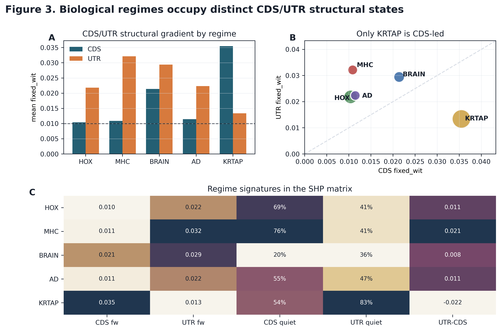
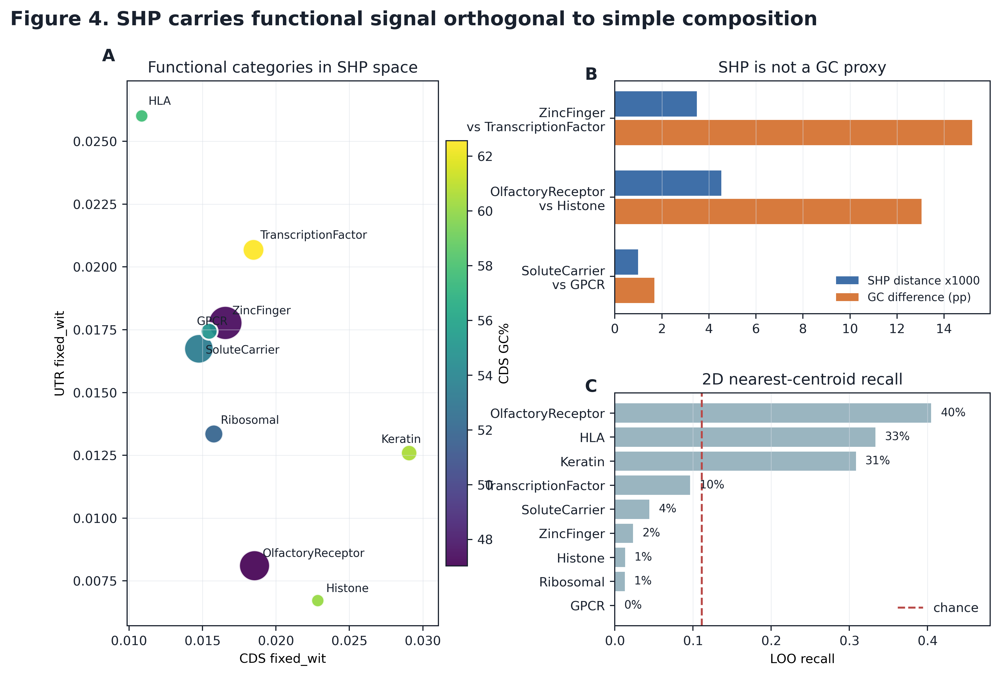

# GeneGrammar / SHP Bridge

NoHarm v0.2 is a warm-start corrected transcript-isoform scanner. It reports a
static codon-landscape coordinate (`ch_range`) and detector-response coordinates
such as `merge_range`, `drift_range`, and `churn_range`.

GeneGrammar is the companion SHP experiment that supplies the planned v0.3
dual-axis coordinate.

## The SHP Coordinate

SHP compares two binary views of the same local nucleotide stream:

- `chroma`: which 3-mers are present in a local window;
- `rhythm`: which adjacent 3-mer transitions occur in that window;
- `cross_harm`: Jaccard distance between the two activation sets;
- `fixed_wit`: event rate above a fair-IID calibration threshold.

Current DNA calibration:

```text
k = 4
n = 3
D = 64
W = 128 nt
theta0 = 0.0999
```

## Current GeneGrammar Result

The current human scan produced a CDS/UTR structural matrix across:

- 19,491 protein-coding genes;
- 224,518 transcript isoforms;
- Ensembl release 115 CDS/cDNA input;
- 8 primary SHP features per gene plus gradients and metadata.

The result is useful because it gives NoHarm a second coordinate family:

```text
NoHarm v0.2      isoform divergence in static and detector-response space
GeneGrammar/SHP  CDS/UTR dual-axis structural spectroscopy
NoHarm v0.3      optional --dual mode for gene and region triage
```

## Figures

### Regime Signatures



### Functional Orthogonality



## Interpretation Boundary

SHP is a structural screening coordinate. It does not diagnose disease, infer
causality, or replace existing transcript annotation workflows. Biological
labels are used after the scan for validation and interpretation, not during
feature computation.

The intended NoHarm use is practical:

> Run a low-prior structural scan first, then compare candidate genes or
> regions against conventional biological annotations, matched nulls, and
> experimental follow-up.

