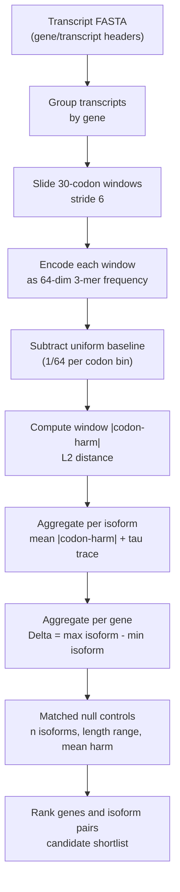

# NoHarm Workflow

NoHarm is designed as a low-friction triage layer for transcript isoform sets.
The first public workflow fixes the encoder so users do not need to tune a
model before seeing whether their data have an extreme isoform-divergence tail.

## Processing Diagram



## Minimal Command

```bash
noharm scan --fasta transcripts.fa.gz --out results/my_scan --workers 8
```

For a local, no-install run from the repository root:

```powershell
$env:PYTHONPATH="src"
python -m noharm scan --fasta data/demo_isoforms.fa --out results/demo
```

## Input Requirements

The default parser supports common transcript FASTA headers:

- GENCODE-style pipe-delimited headers where field 1 is transcript ID and field
  6 is gene name.
- `transcript|gene` two-field headers.
- headers containing `gene=...` or `gene_name=...`.

If a lab has a nonstandard FASTA format, the next practical extension is a
simple mapping table:

```text
transcript_id    gene_id
tx1              geneA
tx2              geneA
```

## Outputs

- `gene_divergence.tsv`: gene-level ranking.
- `isoform_scores.tsv`: per-transcript scores.
- `summary.json`: parameters, distribution, and top genes.
- `report.md`: compact report.

## Interpretation

The primary score asks:

> How different are the codon landscapes that translation must process across
> isoforms of the same gene?

High values nominate genes where isoform choice may produce translation-facing
structural consequences. Low values mean no large difference is detected in this
specific 3-mer coordinate; they do not prove functional equivalence.

## Release Caveats

- Current public scanner reproduces the primary `Delta |codon-harm|` ranking.
- Full research Geruon tau/L3 behavior is documented in the EE research code;
  the standalone repo uses a lightweight tau trace for reporting.
- Matched null and CDS/full controls are currently documented in
  `docs/EXPERIMENT_REPORT.md`; publication-grade biological claims require GC
  matching, GTF-based CDS extraction, and formal GO enrichment.

