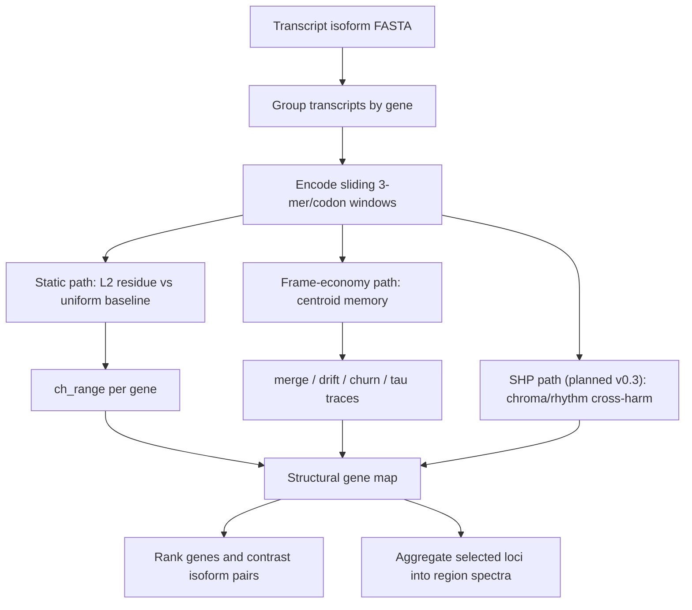

# NoHarm Workflow

NoHarm is designed as a low-friction triage layer for transcript isoform sets.
The workflow fixes the encoder so users can run a reproducible scan before
tuning models or adding biological annotations.

Version 0.2 reports a warm-start corrected evaluation map:

- `ch_range`: static codon-landscape divergence.
- `merge_range`: primary frame-economy response divergence.
- `drift_range`, `churn_range`, `tau_range`: additional response traces.

It is not a clinical tool and not yet a full gene-to-CDS/protein consistency
model. A calibrated SHP dual-axis readout from GeneGrammar is planned for v0.3
as an optional `--dual` mode.

## Processing Diagram



## Minimal Command

```bash
noharm scan --fasta transcripts.fa.gz --out results/my_scan --workers 8
```

This ranks by the default static coordinate, `ch_range`.

To rank by the primary frame-economy response coordinate:

```bash
noharm scan --fasta transcripts.fa.gz --out results/my_scan_merge --workers 8 --rank-by merge_range
```

To inspect other response traces:

```bash
noharm scan --fasta transcripts.fa.gz --out results/my_scan_drift --workers 8 --rank-by drift_range
noharm scan --fasta transcripts.fa.gz --out results/my_scan_churn --workers 8 --rank-by churn_range
```

For a local, no-install run from the repository root:

```powershell
$env:PYTHONPATH="src"
python -m noharm scan --fasta data/demo_isoforms.fa --out results/demo
```

## Input Requirements

The default parser supports common transcript FASTA headers:

- GENCODE-style pipe-delimited headers where field 1 is transcript ID and field
  6 is gene name or gene ID.
- `transcript|gene` two-field headers.
- headers containing `gene=...` or `gene_name=...`.

If a lab has a nonstandard FASTA format, the next practical extension is a
simple mapping table:

```text
transcript_id    gene_id
tx1              geneA
tx2              geneA
```

## Outputs

- `gene_divergence.tsv`: gene-level ranking.
- `isoform_scores.tsv`: per-transcript scores.
- `summary.json`: parameters, distributions, and top genes.
- `report.md`: compact report.

Important gene-level columns:

- `ch_range`: static residue range across isoforms.
- `merge_range`: merge-rate range across isoforms.
- `tau_range`, `novelty_range`, `drift_range`, `churn_range`: additional
  frame-economy traces.
- `contrast_metric`: the active ranking metric used for the contrast pair.
- `min_contrast_transcript`, `max_contrast_transcript`: the reported pair for
  the active ranking metric.
- `min_ch_transcript`, `max_ch_transcript`: the static `ch_range` pair.

## How To Read The Map

The two main questions are:

> Do isoforms from the same gene differ in static codon landscape?

and:

> Do they trigger different frame-economy detector responses?

High `ch_range` nominates genes with large static codon-landscape spread. High
`merge_range`, `drift_range`, or `churn_range` nominates genes whose isoforms
are processed differently by NoHarm's centroid-memory detector. These are
detector responses, not direct cellular mechanism claims.

## From Gene Scan To Region Spectrum

A basic region-spectrum workflow is:

1. Run `noharm scan` on a transcript FASTA.
2. Select a gene list or locus of interest.
3. Extract the coordinate rows for those genes.
4. Summarize static and response coordinates across the region.
5. Compare against matched random regions before making biological claims.

Useful early region questions:

- Does this locus look like a structural-production regime?
- Does it look like an immune-diversity regime?
- Does it look like a regulatory-flexibility regime?
- Are there genes whose response profile differs from their neighbors?

This region mode is an exploratory use of the same gene-level outputs. A
dedicated region CLI is planned for a future release.

## Planned Dual-Axis Extension

The planned `--dual` mode will add a calibrated SHP coordinate:

```text
chroma = local 3-mer presence
rhythm = local 3-mer transition presence
cross-harm = Jaccard distance(chroma, rhythm)
fixed_wit = event rate above fair-IID theta_0
```

This is intended to make region spectra less dependent on a single static
codon-landscape coordinate. The public v0.2 workflow remains the warm-start
corrected baseline until this output is integrated into the CLI.

## Release Caveats

- `merge_range` and related traces are parameterized by window size, memory cap,
  merge radius, and stride.
- Matched null and CDS/full controls are still being expanded.
- Biological annotations are follow-up hypotheses, not validated discoveries.
- Disease and region analyses are exploratory case-study directions, not
  clinical or mechanistic claims.

## Broader Theory

This repo is meant to be usable without accepting any broader theory. Readers
who want the conceptual background can browse the GBE project:
[https://jackeylgene.github.io/GBE](https://jackeylgene.github.io/GBE).
